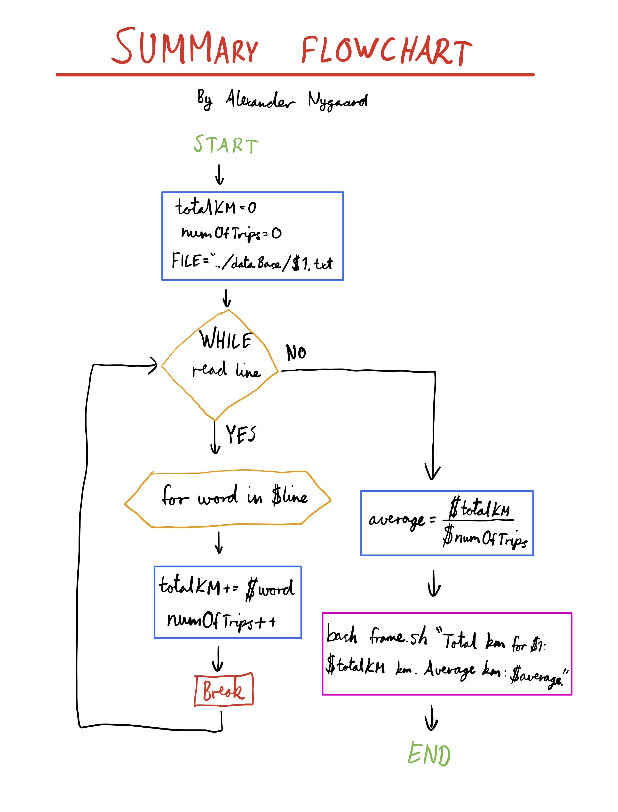

Car Rental Minimal App
===========================

A car rental management minimal app in Bash.

Contents
-----
  1. [Planning](#planning)
  1. [Design](#design)
  1. [Development](#development)
  1. [Evalution](#evaluation)

Planning
----------
### Definition of the problem
The context of the installation is as follows:

The problem that the Car Rental Company faces is as such: The organizational and structural flow and storage of information is not satisfactory. The company currently uses a paper-based solution for which the employees log all the neccessary information, including everything regarding the cars and trips. This heavy reliance on physical paper translates on a practical level into low efficiency and difficult structures and processes for the basic procedures required by the company. The goal of this system installation is to completely replace this unsuitable system to address its many flaws, resulting in better usability, efficiency and overall performance. 

### Proposed solution
The new system will be an easy-to-use, terminal (bash) based software package that will digitize the flow and storage of information within the company. Using this system will greatly increase administrative efficiency, with its new capabilities including being able to create cars, log trips, query the trip history of a car, edit and delete cars, retrieve a summary from a car and safely backing up the data. An easy installation and uninstallation is also required.

### Success Criteria
These are outcomes that can be measured
1. Installation is **simple**, it does not require aditional software, one step process
1. A car can be created
1. A trip can be recorded for a given car
1. A summary (total distance travel, average) of cars can be requested
1. A cars information can be edited
1. A basic working backup system is available
1. The user can easily understand the commands (name notation, documentation)
1. A car information can be deleted
1. The application can be uninstalled

Design
---------

**Fig. 1** This diagram shows the main components of the minimal rental app. It includes the input/outputs and main actions.


Development
--------
### Script for installation
The script below creates the folder structure for the application.
```.sh
#!/bin/bash

# This program creates the folder structure for the minimal rental app

echo "Starting installation"
echo "Installing in the desktop (default). Press enter"
read 

cd ~/desktop

#Create app folder
mkdir RentalCarApp
cd RentalCarApp
mkdir dataBase
mkdir scripts

#Confirm?
echo "Installation complete"
```
This script meets the requirement of the client for a simple installation. However, it could be simplified so that the user does not need to execute the program by typing `bash install.sh`

### Making a frame for the text
This flowchart shows the process behind the script that creates a frame around a string.


### Problem solving
1. How to detect a word's length is odd or even
To detect if the number of characters in a string is odd or even, we must use module (%).
```.sh
(( isEven=$word%2 ))

if [ $isEven -eq 0 ]; then
    echo "This word has an even amount of characters"
fi

```
2. How to create an uninstall program
To uninstall a folder with contents in bash, you must not only use the `rm` command, but also add the argument `-r`.
Full command is `rm -r Folder`

### Developing the steps for the action "Create new car"
This process involves the inputs _,_,_,_, and the outputs:
The following steps describe the algorithm
1. Get the inputs as arguments '$1 $2 $3 $4'
2. Check number of arguments with `if [ $# -eq 4 ]`
3. Store new car inside mainCarFile.txt using `echo "$1 $2 $3 $4 >> mainCarFile.txt`
4. Create file for recording trips as plate.txt with `echo "$1" > plate.txt`

### Developing the steps for the action "Record a trip"
This process involves the inputs _,_, and the outputs:
The following steps describe the algorithm
1. Get the arguments (2) and check
2. Check that the car exist (check if a file exists in bash)
  - `test license.txt`
  - `-f "license.txt"`
3. Add a new line to the file license.txt

### Developing the action Backup you data
There are two methods for backing up the data, one including copying the database to another folder on the desktop and the other involving copying the files to a USB stick.
#### Option 1 (Desktop):
The code required for backing up to a separate folder on the desktop is as follows:
```.sh
#!/bin/bash
# This program creates a backup of the database folder in the app folder

# Starting
echo "Backup starting"

# Navigate to the desktop to create a new folder (backup/)
cd ~/desktop/
# If theres already a folder called "backup", it is removed
rm -r backup
mkdir backup
# Creats subfolder (backup/dataBase/)
cd backup
mkdir dataBase

# Copies all (*) the files from the dataBase folder 
# to the new folder (backup/) and subfolder (backup/dataBase/)
cp ~/desktop/RentalCarApp/dataBase/* ~/desktop/backup/dataBase/
```

#### Option 2 (USB):
This code is for backing up to a USB stick
```.sh
# Save to a usb stick

echo -n "What is your USB stick called? "
read usbName

cd /Volumes/%usbName/
# If theres already a folder called "backup", it is removed
rm -r backup
mkdir backup
# Creats subfolder (backup/dataBase/)
cd backup
mkdir dataBase

# Copy files to USB stick
cp ~/desktop/RentalCarApp/dataBase/* /Volumes/$usbName/backup/dataBase/
```

### Devoloping the Summary action
Below is the flowchart created for the summary bash program.


This script gives the user a summary of the distance driven by a single car.
We can split this task into 3 smaller steps. These steps are outlined below in the code snippet.
```.sh
#!/bin/bash

# Saves the total km
totalKM=0

FILE="../dataBase/$1.txt" # File directory

# Reads the text file line by line
while read line
do

  # Using nested loop, bash splits a line by spaces
  for word in $line
  do
    ((totalKM+=$word)) # Add all the km
    break # Breaks the nested loop after the first iteration, as we only need the km driven
  done

done < $FILE

# Show the total km traveled
bash frame.sh "Total km for $1: $totalKM km"
```

### Developing User Help Files
We are creating manpages (manual pages) to provide the user with help and information about our commands.

For more information about the manpages, please read https://www.cyberciti.biz/faq/linux-unix-creating-a-manpage/

Below is the code created to explain the `create.sh` action:
```.sh
.TH man 6 "29 Oct 2019" "1.0" "create man page"
.SH NAME
create \- Creates a new car
-SH SYNOPSIS
bash create.sh [license] [maker] [model] [passengers]
.SH DESCRIPTION
create is a bash program that allows to create a new car in the database
.SH AUTHOR
Programmer: Alexander Nygaard
```

Evaluation
-----------
### Test 1: 
A car can be created and stored in the database
For this purpose we will create the frile testCreate.sh. This is called software testing.

The **first step** is to check for the file.
```.sh
# Navigate to the scripts folder
cd ../scripts/

# Check if creation script exists
if [ -f "create.sh" ]; then
    echo "File exists, test will start now"
else
    echo "File create.sh does not exist. Test failed"
fi
```
Here the option `-f`in the if condition checks for a file in the working folder.

The **second step** is to use the create script to record a new car TXM901 nissan red 9 (or any other test case).
`bash create.sh TXM901 nissan red 9`

The **third step** is to check that the .txt file was created inside the database folder with the license number:
```.sh
cd ../database
if [ -f "TXM901.txt" ]; then
    echo "Test one: file with the license plate created successfully. Passed"
else
    echo "Test one: file with license number not found: Failing"
fi
```

The **fourth step** is to check if the last line of the mainCarFile.txt is "TXM901 nissan red 9".
```.sh
# Saves the last line of mainCarFile.txt into the variable lastline
lastline=$( tail -n 1 mainCarFile.txt )

# Checks if the last line is equal to the test case
if [ "$lastline" == "TXM901 nissan red 9" ]; then
    echo "Test completed successfully. File created, and information added to mainCarFile.txt"
else
    echo "Test failed. No TXM901 in mainCarFile.txt"
fi
```
Notice: `lastline=$( tail -n 1 mainCarFile.txt )` is used to save and store the last line of any text file into a string.

#### This corresponds to a dynamic type of testing
This is called **dynamic testing** because we executed the programmed code with a given test case. In other words, the testing took place while the system was run.

This testing was also a type of **alpha testing**, meaning only the internal employees and developers of an organization tested the software, in contrast to beta testing where external clients and end users test.

Lastly, we also tested the code useing the **white-box method**. We used the information and knowledge available about the internals of the system to understand what was wrong and to fix the various bugs met.

This was also a type of **automatic testing**, atleast in the sense of the program we created. The new testing script will be able to control the execution of tests and then compare actual results with the predicted or expected results. 


