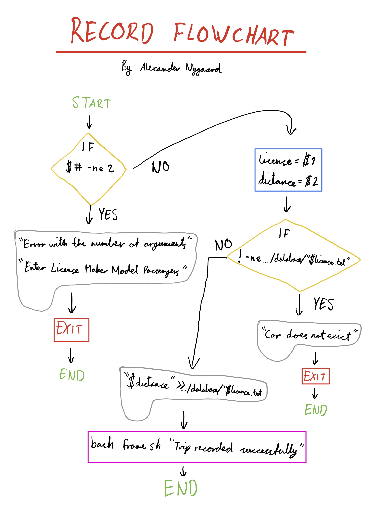

```.py
Marks=28
Demo=4
Total=(Marks+Demo)=32
```
**Graded on Nov 6**
Car Rental Minimal App
===========================

A car rental management minimal app in Bash.

Contents
-----
  1. [Planning](#planning)
  1. [Design](#design)
  1. [Development](#development)
  1. [Evalution](#evaluation)
  1. [Improvements](#improvements)

Planning
----------
### Definition of the problem
The context of the installation is as follows:

The problem that the Car Rental Company faces is as such: The organizational and structural flow and storage of information is not satisfactory. The company currently uses a paper-based solution for which the employees log all the neccessary information, including everything regarding the cars and trips. This heavy reliance on physical paper translates on a practical level into low efficiency and difficult structures and processes for the basic procedures required by the company. The goal of this system installation is to completely replace this unsuitable system to address its many flaws, resulting in better usability, efficiency and overall performance. 

### Proposed solution
The new system will be an easy-to-use, terminal (bash) based software package that will digitize the flow and storage of information within the company. Using this system will greatly increase administrative efficiency, with its new capabilities including being able to create cars, log trips, query the trip history of a car, edit and delete cars, retrieve a summary from a car and safely backing up the data. An easy installation and uninstallation is also required.

### Success Criteria
These are outcomes that can be measured
1. Installation is **simple**, it does not require aditional software, one step process
1. A car can be created
1. A trip can be recorded for a given car
1. A summary (total distance travel, average) of cars can be requested
1. A cars information can be edited
1. A basic working backup system is available
1. The user can easily understand the commands (name notation, documentation)
1. A car information can be deleted
1. The application can be uninstalled

**Criterion A**

|Level|Descriptor|
|----|-----|
|5|The client in the car rental office is identified and his situation described. The rationale for choosing the proposed product (Computer tools used) is justified and includes a range of appropriate criteria for evaluating the success of the product.|
```.sh
Rational
* Great job with this criterion! You could improve it by adding justifications for the tools used including BASH/GIT. One simple reason is that we are learning those tools in class 
```

Design
---------

**Fig. 1** This diagram shows the main components of the minimal rental app. It includes the input/outputs and main actions.

## Criterion B
|**level**|**Description**|
|-----|------------|
|10|An outline test plan, are detailed and complete. A system diagram and at least 3 flow diagrams for algorithms in the product are included. From this information it is clear how the product was developed.|
```.sh
Rationale
* Great job with the flow diagrams and the system diagram.
* You are losing marks in this criterion because you did not include the figure captions and the descriptions after every figure. This is important because you want to use adequately images to draw the attention of the reader to salient points.
The description is a paragraph that explains the figure and tells the reader why you included the figure: "As seen in Fig. 1. the system proposed for the CarRentalApp consist of ..." 
```

Development
--------
### Script for installation
The script below creates the folder structure for the application.

**NOTE:** This script should (but it is not required) be run with the command `source install.sh`, instead of `bash install.sh`.

```.sh
#!/bin/bash

# This program creates the folder structure for the minimal rental app

bash frame.sh "Welcome. Starting installation"

echo "Installing in the desktop (default). Press enter"
read

# Create app folder

mkdir scripts
mv ~/desktop/RentalCarApp/*.sh ~/desktop/RentalCarApp/scripts/
mkdir dataBase
cd scripts

# Confirm
echo "Installation complete"
```
This script meets the requirement of the client for a simple installation. However, it could be simplified so that the user does not need to execute the program by typing `source install.sh`

### Making a frame for the text
This flowchart shows the process behind the script that creates a frame around a string.


### Mini-problem solving
1. How to detect a word's length is odd or even
To detect if the number of characters in a string is odd or even, we must use module (%).
```.sh
(( isEven=$word%2 ))

if [ $isEven -eq 0 ]; then
    echo "This word has an even amount of characters"
fi
```
2. How to create an uninstall program
To uninstall a folder with contents in bash, you must not only use the `rm` command, but also add the argument `-r`.
Full command is `rm -r Folder`

3. Moving files
To move files, you must use the command `mv [source] [destination]`
Another important and useful tip is to use the `*.sh` ending for the [source]. This ensures that only all the .sh files are moved.

4. Launching a program with source
I quickly encountered the issue of the `bash [filename]` command, meaning that the script is executed in a sub-shell. This was undesirable, mainly because during the installation it is useful that the current terminal session of the user remains in the directory of the scripts. This is important because then the user can immediately start executing scripts, and not be required to type `cd scripts`.
To fix this issue, the command `source [filename]` or `. [filename]` can be used instead. This `source` command reads and executes commands from the file specified as its argument in the current shell environment. In practical terms, this results in the user remaining in the /scripts directory after executing the installation file. ([Source](https://linuxize.com/post/bash-source-command/), published 17. Jun 2019, retrived 31. Oct 2019)

### Developing the steps for the action "Create new car"
This process involves the inputs _,_,_,_, and the outputs:
The following steps describe the algorithm
1. Get the inputs as arguments '$1 $2 $3 $4'
2. Check number of arguments with `if [ $# -eq 4 ]`
3. Store new car inside mainCarFile.txt using `echo "$1 $2 $3 $4" >> mainCarFile.txt`
4. Create file for recording trips as plate.txt with `echo "" > $license.txt`

### Developing the steps for the action "Record a trip"
This process involves the inputs _,_, and the outputs:
The following steps describe the algorithm
1. Get the arguments (2) and check
2. Check that the car exist (check if a file exists in bash)
  - `test license.txt`
  - `-f "license.txt"`
3. Add a new line to the file license.txt

This flowchart illustrates the algorithms structure:


### Developing the action "Backup your data"
There are two methods for backing up the data, one including copying the database to another folder on the **desktop** and the other involving copying the files to a **USB stick**.

The full script asks the user which method is preferred, and executes the appropriate code. The code below are merely snippets of the full program (the unique options).

#### Option 1 (Desktop):
The code required for backing up to a separate folder on the desktop is as follows:
```.sh
# Navigate to the desktop to create a new folder (backup/)
cd ~/desktop/
# If theres already a folder called "backup", it is removed
rm -r backup
mkdir backup
# Creats subfolder (backup/dataBase/)
cd backup
mkdir dataBase

# Copies all (*) the files from the dataBase folder 
# to the new folder (backup/) and subfolder (backup/dataBase/)
cp ~/desktop/RentalCarApp/dataBase/* ~/desktop/backup/dataBase/

### NOT NECESSARY, ONLY FOR AESTHETIC PURPOSES
# Prints the frame
# Navigates to the folder of the frame.sh script
cd ~/Desktop/RentalCarApp/scripts/
bash frame.sh "Installation complete"
```

#### Option 2 (USB):
This code is for backing up to a USB stick
```.sh
# Save to a usb stick

echo -n "What is your USB stick called? "
read usbName

cd /Volumes/$usbName/
# If theres already a folder called "backup", it is removed
rm -r backup
mkdir backup
# Creats subfolder (backup/dataBase/)
cd backup
mkdir dataBase

# Copy files to USB stick
cp ~/desktop/RentalCarApp/dataBase/* /Volumes/$usbName/backup/dataBase/
```

### Devoloping the Summary action
Below is the flowchart created for the summary bash program.


This script gives the user a summary of the total and average distance driven by a single car.
```.sh
#!/bin/bash

# This program gives a summary of a car, including total distance and average distance per trip

totalKM=0
numOfTrips=0

FILE="../dataBase/$1.txt"
while read line
do
  # Bash splits a line by spaces
  for word in $line
  do
    # Add all the km
    ((totalKM+=$word))
    ((numOfTrips++))
    break
  done

done < $FILE

((average=$totalKM/$numOfTrips))

# Show very nicely the total km traveled

bash frame.sh "Total km for $1: $totalKM km. Average km: $average km."
```

### Developing A User Help File
To create a help file or documentation on the commands for the user, one could either create a manpage or a simple help script. Both are outlined below:

When creating manpages (manual pages) to provide the user with help and information about our commands, we must follow the instructions outlined on the webpage below.

For more information about the manpages, please read https://www.cyberciti.biz/faq/linux-unix-creating-a-manpage/

However, when attempting to create these manpages I ran into mulitple technical errors. After a long and continous effort to fix these issues, I decided to rather switch to making a **simple help script**. This would essentially work as a normal bash script, while receiving one argument (being the command that the user is curious about).
The script would then provide the
1. Name
1. Synopsis
1. Description
1. Author

Below is the a sample code created to show the structure of the output of the help action:
```.sh
if [ $1 == "create" ]; then
    echo "** NAME **"
    echo "  create - Creates a new car"
    echo ""

    echo "** SYNOPSIS **"
    echo "  bash create.sh [license] [maker] [model] [passengers]"
    echo ""

    echo "** DESCRIPTION **"
    echo "  Create is a bash program that allows to create a new car in the database"
    echo ""

    echo "** AUTHOR **"
    echo "  Programmer: Alexander Nygaard"
```
## Criterion C
|**level**|**Description**|
|-----|------------|
|6|The proposed solution is characterized by the appropriate use of existing tools. The techniques are adequate for the task and their use is explained. All sources are identified.|
```.sh
Rationale
* Neat work here Alex
* Let's start using citations and a References section at the end of the document. Use the references in the body of the development where you use the information, for example: "As shown in [1], we can read from a file in bash using ...", and then in the References section you add the MLA entry.
```

Evaluation
-----------

To evaluate the provided solution, the success criteria from the planning chapter must be revisited.
As a reminder, the success criteria needed to ensure that the client will be satisfied with the product are as follows:

1. Installation is **simple**, it does not require aditional software, one step process
1. A car can be created
1. A trip can be recorded for a given car
1. A summary (total distance travel, average) of cars can be requested
1. A cars information can be edited
1. A basic working backup system is available
1. The user can easily understand the commands (name notation, documentation)
1. A car information can be deleted
1. The application can be uninstalled

I have outlined these steps in the table for the Test Plan below. To ensure these the software package works, these steps must be followed in order and with the recommended input. To see if the step was a success, the actual result can be compared and evaluated against the intended "output" listed in the table:

| Step                                       | Input                               | Output                                                                | Check |
|--------------------------------------------|-------------------------------------|-----------------------------------------------------------------------|-------|
| 1. App is easily installed                 | souce install.sh                    | Folder is created with all files correct directory                    | Yes   |
| 2. Create a car                            | bash create.sh ABC123 toyota 2004 5 | File ABC123.txt is created, mainCarFile.txt is updated                | Yes   |
| 3. A trip can be recorded                  | bash record.sh ABC123 350           | File ABC123.txt is updated, the distance is added to a new line       | Yes   |
| 3. Summary                                 | bash summary.sh ABC123              | Total km driven, and average per trip is displayed                    | Yes   |
| 4. A car can be edited                     | bash edit.sh ABC123 nissan 2007 7   | File mainCarFile.txt is updated, info for the specific car is changed | Yes   |
| 5. Backup system works                     | bash backup.sh                      | A backup is created either on the desktop or on a USB                 | Yes   |
| 6. User can easily understand the commands | bash help.sh [command]              | Detailed and relevant information regarding the commands              | Yes   |
| 7. Car info can be deleted                 | bash delete.sh ABC123               | Car info is removed from mainCarFile.txt and from the dataBase        | Yes   |
| 8. App can be uninstalled                  | bash uninstall.sh                   | There are zero files left after the uninstall                         | Yes   |

### Examples of testing with software

When testing the functionality of the program, **software testing** can be used for more efficient and easy testing. This essentially means creating a program that executes a predetermined function of the software package, as shown below. Using proper error logging, it becomes much easier to spot and identify bugs. Outlined below there are 3 different testing programs that test 3 individual functionalities of the software; create, record and edit.

### Test 1: Create
A car can be created and stored in the database
For this purpose we will create the file testCreate.sh. This is called **software testing**.

The **first step** is to check for the file.
```.sh
# Navigate to the scripts folder
cd ../scripts/

# Check if creation script exists
if [ -f "create.sh" ]; then
    echo "File exists, test will start now"
else
    echo "File create.sh does not exist. Test failed"
    exit
fi
```
Here the option `-f`in the if condition checks for a file in the working folder.

The **second step** is to use the create script to record a new car TXM901 nissan red 9 (or any other test case).
`bash create.sh TXM901 nissan red 9`

The **third step** is to check that the .txt file was created inside the database folder with the license number:
```.sh
cd ../database
if [ -f "TXM901.txt" ]; then
    echo "Test one: file with the license plate created successfully. Passed"
else
    echo "Test one: file with license number not found: Failing"
    exit
fi
```

The **fourth step** is to check if the last line of the mainCarFile.txt is "TXM901 nissan red 9".
```.sh
# Saves the last line of mainCarFile.txt into the variable lastline
lastline=$( tail -n 1 mainCarFile.txt )

# Checks if the last line is equal to the test case
if [ "$lastline" == "TXM901 nissan red 9" ]; then
    echo "Test completed successfully. File created, and information added to mainCarFile.txt"
else
    echo "Test failed. No TXM901 in mainCarFile.txt"
fi
```
Notice: `lastline=$( tail -n 1 mainCarFile.txt )` is used to save and store the last line of any text file into a string.

The **fifth step** is deleting the test car, and completing the test.
```.sh
cd ../scripts/

bash frame.sh "Test complete. Passed. Press enter to delete test car."
read b

# Delete test car
bash delete.sh TXM901
```

#### This corresponds to a dynamic type of testing
This is called **dynamic testing** because we executed the programmed code with a given test case. In other words, the testing took place while the system was run.

This testing was also a type of **alpha testing**, meaning only the internal employees and developers of an organization tested the software, in contrast to beta testing where external clients and end users test.

Lastly, we also tested the code useing the **white-box method**. We used the information and knowledge available about the internals of the system to understand what was wrong and to fix the various bugs met.

This was also a type of **automatic testing**, atleast in the sense of the program we created. The new testing script will be able to control the execution of tests and then compare actual results with the predicted or expected results. 


### Test 2: Record
A trip can be recorded, with the distance driven added to the car .txt file.
For this purpose we will create the file testRecord.sh. This is called **software testing**.

The **first step** is to check for the create file.
```.sh
# Navigate to the scripts folder
cd ../scripts/

# Check if creation script exists
if [ -f "create.sh" ]; then
    echo "File exists, test will start now"
else
    echo "File create.sh does not exist. Test failed"
    exit
fi
```

The **second step** is to create a test car, and record a test trip.
```.sh
# Create test car
bash create.sh QWT789 porche 2010 4

# Record a test trip
bash record.sh QWT789 275
```

The **third step** is to check that the trip was recorded successfully.
```.sh
# Check that the .txt file was created
cd ../dataBase

# Saves the last line of QWT789.txt into the variable lastline
lastline=$( tail -n 1 QWT789.txt )

if [ "$lastline" == "275" ]; then
    echo "Test one: trip recorded successfully. Passed"
else
    echo "Test one: trip not found: Failing"
    exit
fi
```

The **fourth step** is to delete the test car, and complete the test.
```.sh
cd ../scripts/

bash frame.sh "Test complete. Success. Press enter to delete test car."
read a

# Delete test car
bash delete.sh QWT789
```


### Test 3: Edit
A cars information can be edited, with the maker, model and no. of passengers being changed.
For this purpose we will create the file testEdit.sh. This is called **software testing**.

The **first step** is to check for the edit file.
```.sh
# Navigate to the scripts folder
cd ../scripts/

# Check if edit script exists
if [ -f "edit.sh" ]; then
    echo "File exists, test will start now"
else
    echo "File record.sh does not exist. Test failed"
    exit
fi
```

The **second step** is to create a test car, and check if the information was added to the mainCarFile.txt successfully.
```.sh
# Creates a new test car
bash create.sh WDC456 bmw 2009 6

# Check that the .txt file was created
cd ../dataBase/

# Saves the last line of WDC456.txt into the variable lastline
lastline=$( tail -n 1 mainCarFile.txt )

if [ "$lastline" == "WDC456 bmw 2009 6" ]; then
    echo "Test one: car created successfully. Passed"
else
    echo "Test one: car not found: Failing"
    exit
fi
```

The **third step** is to edit the car information 
```.sh
# Edits the information of the car
cd ../scripts/
bash edit.sh WDC456 audi 2010 7

# Check that the .txt file was created
cd ../dataBase

# Saves the last line of WDC456.txt into the variable lastline
lastline=$( tail -n 1 mainCarFile.txt )

if [ "$lastline" == "WDC456 audi 2010 7" ]; then
    echo "Test two: car created successfully. Passed"
else
    echo "Test two: car not found: Failing"
    exit
fi
```

The **fourth step** is deleting the test car and completing the test.
```.sh
# Test finished
cd ../scripts/
bash frame.sh "Test complete. Success. Press enter to delete test car."
read a
# Deletes the car
bash delete.sh WDC456
```


Improvements
-----------

Overall, this product has met all the requirements of the client and performs its intended tasks well. It is completed with all the intended functionalities that were realistic to include in the time limit of the development. Given more time, more features could have been added, and existing features could have been improved further. **A few steps I would recommend for future improvements to this software package would be as follows:**

##### Easier opening and closing of the program.
When starting up the computer running the program, the client would have to manually open the terminal and navigate to the `/scripts` folder to be able to run the programs. A better solution would be an .exe application that the client could launch, and immediately be ready to execute commands.

##### Improving the backup system
Currently, the backup system is quite primitive and simple. The choice of backing up to the desktop or to an USB stick might not be enough for many users. This problem could be solved by uploading to a remote server or a cloud service provider. I believe this could be accomplished using various libraries readily available already.

##### Graphical User Interface
The current text-based user interface might be perceived as intimidating and difficult to use by certain clients. An improved GUI application would greatly improve both the user experience and the usability of the product. While not knowing specifically how this would be accomplished, I know there are many GUI libraries in various programming languages. 

## Criterion D
|**level**|**Description**|
|-----|------------|
|6|The product is fully evaluated against the success criteria identified in criterion A. Recommendations for further improvement of the product are realistic.|
```.sh
Rationale
* The Improvements are realistic and necessary. Good job with the test plan and the evaluation of the criteria.
```
