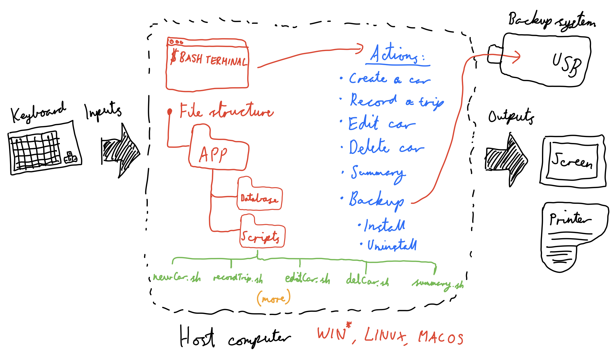
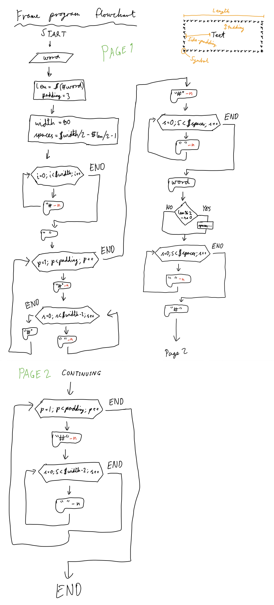

Car Rental Minimal App
===========================

A car rental management minimal app in Bash.

Contents
-----
  1. [Planning](#planning)
  1. [Design](#design)
  1. [Development](#development)
  1. [Evalution](#evaluation)

Planning
----------
### Definition of the problem
The context of the installation of the car rental system is as follows. 

It is obvious that the new system’s purpose is to outperform a previously used system, which might have been unsuitable for its purpose, inefficient, redundant or simply out-dated. 

This new system will only replace the software of the previous system, while the hardware, people working on it and the immediate environment will most likely remain the same. However, the knowledge required to utilize and use the system would change, and thus retraining of relevant personnel would also be necessary.

It is also essential to examine the 5 TELOS principles. The technological aspect of the previous system would be sufficient to sustain the new system. Based on assumptions, the economic impact would be beneficial because of the increased efficiency of the information flow and storage. The legal, operational and schedule feasibility is quite irrelevant, and would not change while exchanging systems.

Design
---------

**Fig. 1** This diagram shows the main components of the minimal rental app. It includes the input/outputs and main actions.

### Flow diagram from creating a frame in bash


Development
--------
### 1. Script for installation
The script below creates the folder structure for the application.
```.sh
#!/bin/bash

# This program creates the folder structure for the minimal rental app

echo "Starting installation"
echo "Installing in the desktop (default). Press enter"
read 

cd ~/desktop

#Create app folder
mkdir RentalCarApp
cd RentalCarApp
mkdir dataBase
mkdir scripts

#Confirm?
echo "Installation complete"
```
This script meets the requirement of the client for a simple installation. However, it could be simplified so that the user does not need to execute the program by typing `bash install.sh`

### 2. Making a frame for the text
This flowchart shows the process behind the script that creates a frame around a string.



### Problem solving
1. How to detect a word's length is odd or even
To detect if the number of characters in a string is odd or even, we must use module (%).
```.sh
(( isEven=$word%2 ))

if [ $isEven -eq 0 ]; then
    echo "This word has an even amount of characters"
fi

```
2. How to create an uninstall program
To uninstall a folder with contents in bash, you must not only use the `rm` command, but also add the argument `-r`.
Full command is `rm -r Folder`

Evaluation
-----------


